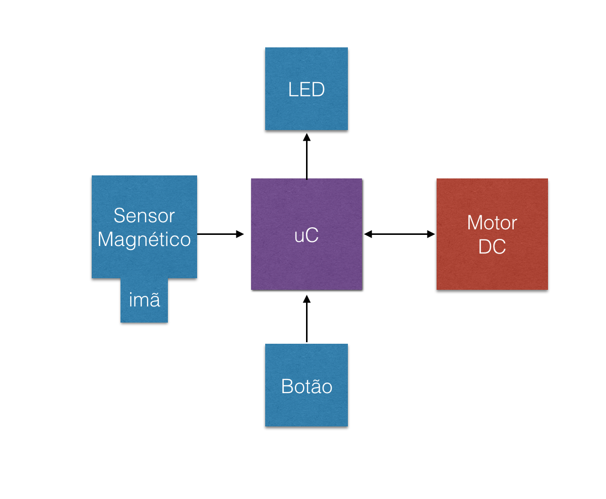

# Projeto-1-Mundo-Digital

## Descrição:
Dispensers são misturadores desenvolvidos para a indústria de cosméticos. Esses copos misturadores funcionam com uma base comum que contem um motor DC embutido que poderá ser acionado de duas formas, de acordo com a preferência do usuário. Esse motor poderá ser acionado através de um botão ou através do encaixe na base utilizando um sensor magnético.

## Materiais Nescessários
-SAM E70

-LED

-BOTÃO

-SENSOR MAGNÉTICO + IMÃ

-MOTOR DC

## Diagrama de Blocos Simples

